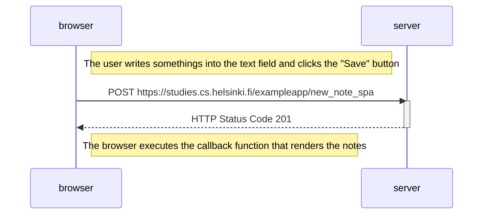

```mermaid
sequenceDiagram
    participant browser
    participant server

    Note right of browser: The user writes somethings into the text field and clicks the "Save" button

    browser->>server: POST https://studies.cs.helsinki.fi/exampleapp/new_note_spa
    activate server

    server-->>browser: HTTP Status Code 201
    deactivate server

    Note right of browser: The browser executes the callback function that renders the notes
```
